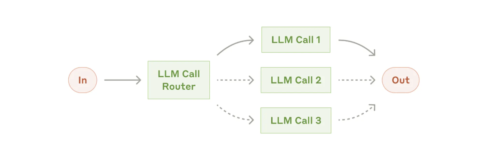
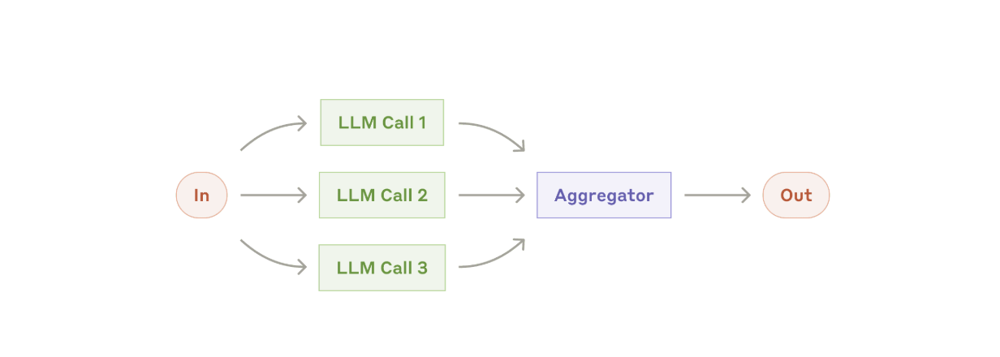
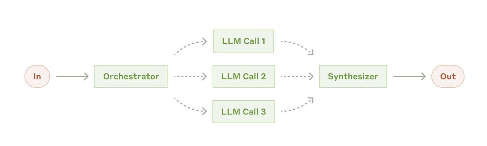
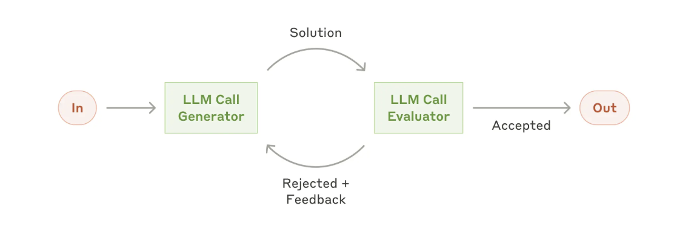
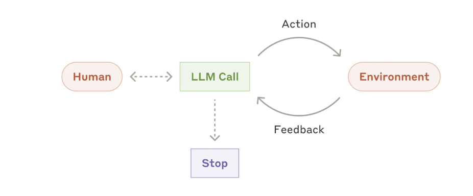

# 构建高效 AI Agent

> 原文：[Building effective agents](https://www.anthropic.com/engineering/building-effective-agents)  
> 来源：Anthropic Engineering  
> 发布时间：2024 年 12 月 19 日  

> [!NOTE]
> Anthropic 在原网页中说明，自 2024 年 12 月以来，相关工具生态已经发生变化。本文更适合用于理解通用的 Agent 架构模式、工具设计方法和工程原则。

## 1. 核心观点

Anthropic 在与多个行业团队共同构建 LLM Agent 后发现：

> 成功的 Agent 系统通常采用简单、可组合的模式，而不是复杂的框架或过度抽象的架构。

构建 Agent 应当遵循渐进式原则：

1. 首先尝试单次 LLM 调用。
2. 根据需要加入检索、工具和上下文示例。
3. 简单方案无法满足要求时，再引入多步骤工作流。
4. 只有当任务路径无法预先确定时，才使用自主 Agent。
5. 只有在评测证明效果有所提升时，才增加系统复杂度。

## 2. Workflow 与 Agent 的区别

Anthropic 将广义的 Agentic System 分为两类：

| 类型 | 流程控制者 | 核心特点 | 适用场景 |
| --- | --- | --- | --- |
| Workflow（工作流） | 预先编写的代码 | 执行路径固定、行为可预测 | 任务结构明确，可以提前拆分步骤 |
| Agent（自主智能体） | LLM | 动态规划、选择工具并决定下一步 | 执行路径和步骤数量难以预先确定 |

两者的本质区别不在于是否调用工具，而在于：

> 谁负责决定下一步做什么。

- 如果执行顺序由程序预先规定，就是 Workflow。
- 如果执行顺序由 LLM 根据环境反馈动态决定，就是 Agent。

## 3.基础构件：增强型 LLM

Agent 系统的基础构件是一个具有外部能力的 LLM，即 Augmented LLM。

常见的增强能力包括：

- **Retrieval（检索）**：从网页、知识库或代码库获取信息；
- **Tools（工具）**：调用 API、执行代码、读写文件或操作外部系统；
- **Memory（记忆）**：保留跨步骤或跨会话的重要信息。

增强型 LLM 可以：

- 自行生成检索查询；
- 根据任务选择工具；
- 决定什么时候调用工具；
- 判断哪些信息需要被保留。

## 4. 常见 Workflow 模式

Anthropic 总结了五种常见的 Workflow 模式：

1. Prompt Chaining；
2. Routing；
3. Parallelization；
4. Orchestrator–Workers；
5. Evaluator–Optimizer。

## 4.1 Prompt Chaining：提示链

### 基本结构

Prompt Chaining 将复杂任务拆分成一系列固定步骤。每次 LLM 调用处理上一步的输出，并将结果传递给下一步。

系统还可以在中间加入程序化检查点，确保执行过程没有偏离目标。

### 主要风险

- 上游错误会传递给下游；
- 步骤越多，延迟和调用成本越高；
- 如果任务无法稳定拆解，固定链条会显得过于僵化。

## 4.2 Routing：路由

### 基本结构

Routing 首先判断输入属于哪一类，然后将其分配给专门的模型、提示词、工具或后续流程。

### 主要风险

- 路由错误会使后续流程从一开始就走错方向；
- 类别边界不清时，系统行为可能不稳定；
- 需要为路由器本身建立独立评测。

## 4.3 Parallelization：并行化

Parallelization 有两种主要形式：

1. Sectioning：任务分片；
2. Voting：多次执行或投票。

### Sectioning：任务分片

将任务拆分成多个相互独立的子任务，并行执行后再聚合结果。

### Voting：多次执行或投票

让多个模型调用独立处理同一个任务，然后聚合不同判断。

### 主要风险

- 聚合规则不合理可能抵消并行收益；
- 多个调用可能产生高度相关的错误；
- 计算成本通常会随着并行分支数量增加。

## 4.4 Orchestrator–Workers：编排者—工作者

### 基本结构

中央 LLM 作为 Orchestrator，根据具体输入动态拆解任务，将子任务交给多个 Worker，最后综合各个 Worker 的结果。

### 主要风险

- Orchestrator 的拆解错误会影响所有 Worker；
- Worker 输出可能重复、冲突或遗漏；
- 汇总阶段可能丢失证据或错误合并结论；
- 动态子任务会增加评测和调试难度。

## 4.5 Evaluator–Optimizer：评估者—优化者

### 基本结构

一个 LLM 负责生成结果，另一个 LLM 根据明确标准进行评价并给出反馈。

生成器根据反馈继续修改，直到达到质量要求或触发停止条件。

### 主要风险

- 评估器可能继承生成器的偏差；
- 评价标准模糊时，反馈容易变得空泛；
- 没有停止条件时，系统可能持续修改但没有实际提升；
- 生成器可能只针对评估器进行表面优化。

## 5. 自主 Agent

### 基本运行循环

Agent 通常从用户指令或多轮对话开始。

任务明确后，Agent 自主制定计划、调用工具并观察环境反馈，直到完成任务或触发停止条件。

> LLM 根据环境反馈不断选择和调用工具，形成循环。

## 6. 典型应用场景

### 6.1 客户支持 Agent

客户支持适合使用 Agent，原因包括：

- 用户交互天然以多轮对话展开；
- 需要查询客户资料、订单历史和知识库；
- 可以通过工具执行退款、修改订单或更新工单；
- 成功标准通常可以定义为问题是否得到解决。

这一场景同时包含“对话”和“行动”，并且能够建立明确的反馈闭环。

### 6.2 Coding Agent

软件开发是 Agent 的重要应用场景，原因包括：

- 代码结果可以通过自动化测试验证；
- Agent 可以根据测试结果迭代修改；
- 问题空间相对明确且结构化；
- 输出质量可以较为客观地测量；
- 复杂任务通常需要动态确定要修改的文件和代码位置。

## 7. 工具设计与 ACI

工具是 Agent 与外部环境交互的接口。

Anthropic 将其称为：

**Agent–Computer Interface，简称 ACI。**

工具的名称、描述、参数和返回格式，会直接影响模型能否正确使用工具。因此，工具定义本身也需要进行提示工程。

可以将 ACI 与 HCI 对比理解：

- HCI 关注人如何使用计算机；
- ACI 关注 Agent 如何使用计算机；
- 如果一个接口对人类来说难以理解，对模型来说通常也不会容易。

## 参考资料

- [Building effective agents — Anthropic](https://www.anthropic.com/engineering/building-effective-agents)
- [Model Context Protocol](https://modelcontextprotocol.io/)
- [SWE-bench](https://www.swebench.com/)